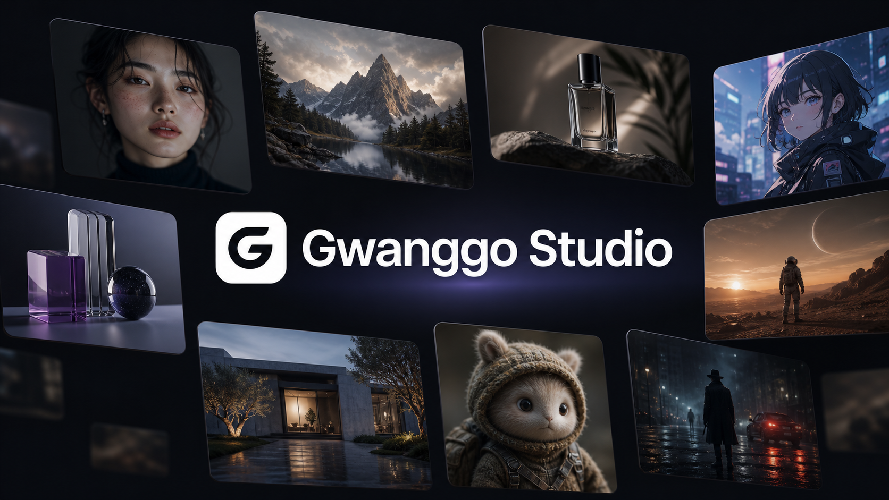
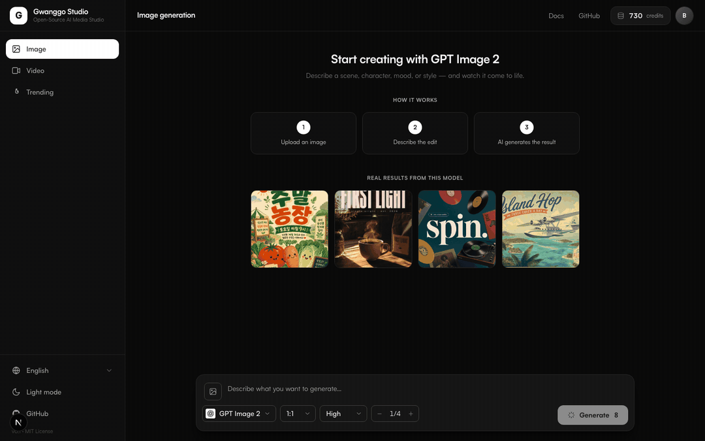
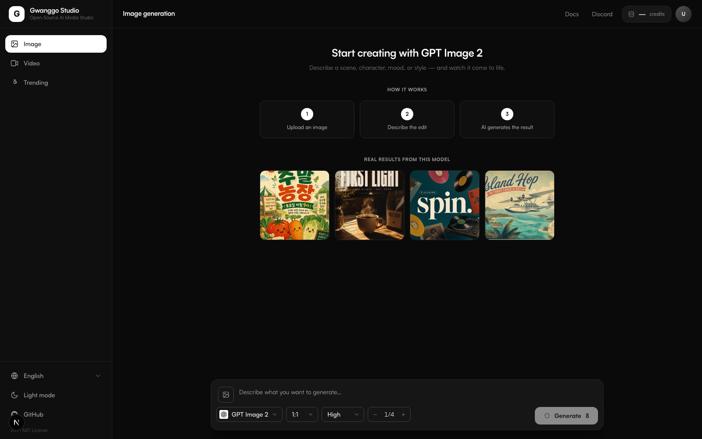
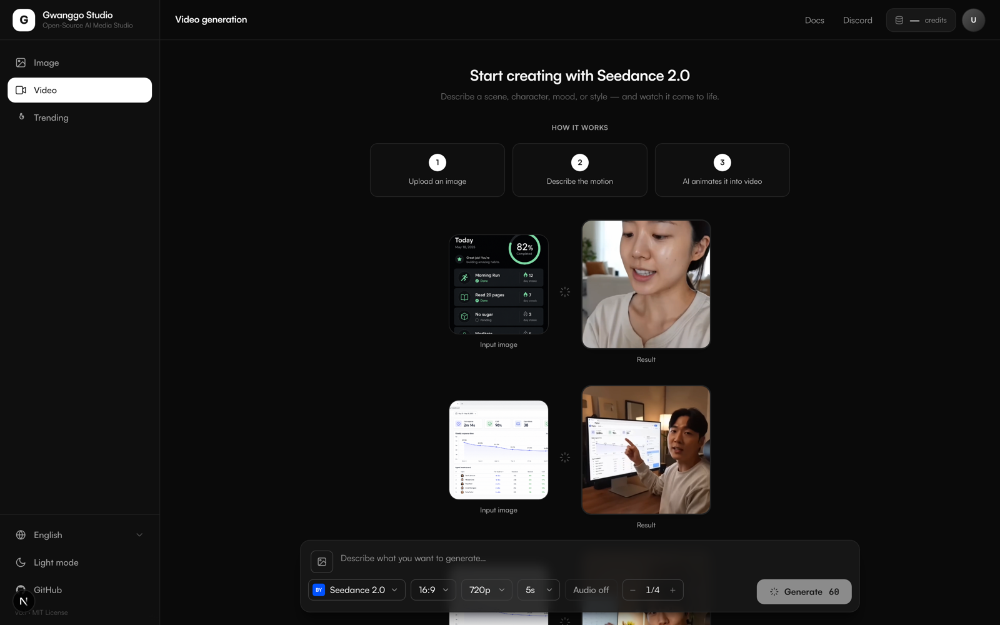
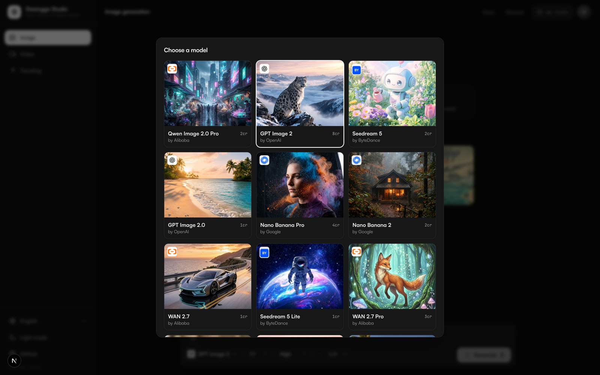

<div align="center">





<br />

# ⚡ Gwanggo Studio

### トップAI画像・動画モデルのすべて。キーひとつ。あなたのマシンで。

**Seedream、Sora、Veo、Kling、GPT Image、Nano Banana — さらに30以上のモデルのためのオープンソーススタジオ。**

[](./LICENSE)
[](https://nextjs.org)
[](https://react.dev)
[](#-モデル)
[](#-コントリビュート)

[English](./README.md) · [한국어](./README.ko.md) · **日本語** · [中文](./README.zh.md)

[クイックスタート](#-クイックスタート60秒) · [スクリーンショット](#-プレビュー) · [モデル](#-モデル) · [API](#%EF%B8%8F-内部のapi) · [設定](#%EF%B8%8F-設定)

</div>

---

> **クローズドなプラットフォームは、最高のモデルを壁の向こうに閉じ込めています。**
> Gwanggo Studioはその壁を壊します。リポジトリをクローンし、キーをひとつ貼り付けるだけで、1行ずつ読める完全に自分のものであるアプリから、同じフロンティアモデルで生成できます。

<br />

## 👀 プレビュー

<table>
<tr>
<td width="50%">

<p align="center"><sub><b>画像生成</b> — 各モデルの実際の生成結果とリアルタイムのクレジットコスト</sub></p>
</td>
<td width="50%">

<p align="center"><sub><b>動画生成</b> — 入力 → 結果プレビュー、モデルごとの詳細オプション</sub></p>
</td>
</tr>
</table>


<p align="center"><sub><b>モデルピッカー</b> — ひとつのグリッドにすべてのフロンティアモデル、公式プロバイダーロゴと実際のサンプル出力</sub></p>

<br />

## 🥊 なぜGwanggo Studioなのか

|                   | クローズドなAIスタジオ       | **Gwanggo Studio**                          |
| ----------------- | ---------------------------- | ------------------------------------------- |
| ソースコード      | 🔒 非公開                    | ✅ **MIT — 読める、フォークできる、所有できる** |
| モデルラインナップ | 1社のモデルのみ              | ✅ **全プロバイダー横断の35+モデル**         |
| 必要なアカウント  | プロバイダーごとに1つ        | ✅ **キーひとつですべて**                    |
| 実行場所          | 彼らのサーバー、彼らのルール | ✅ **あなたのマシン**                        |
| 価格の透明性      | 不透明なサブスク             | ✅ **すべてのボタンに正確なクレジット表示**  |

<br />

## ✨ ハイライト

- 🎨 **35+のフロンティアモデル、キーひとつ。** ByteDance、OpenAI、Google、Kuaishou、Alibaba、xAIなど、あらゆるプロバイダーの画像・動画生成を単一のホステッドAPIで。
- 🧩 **本物のオープンソース (MIT)。** スタジオは純粋なクライアント。リポジトリに隠れたバックエンドもテレメトリーもありません。
- ⚡ **常に見える正直な価格。** 各モデルは実際のオプション(アスペクト比、解像度、長さ、オーディオ)を公開し、Generateボタンに正確なクレジットコストをリアルタイム表示。
- 🖼️ **画像から動画 & 参照画像。** 参照画像をアップロードして、I2V・モーションコントロール・編集ワークフローを駆動。
- 🌗 **デフォルトで美しい。** ダークモード、集中できる単一画面フロー、公式プロバイダーロゴ、モデルごとの実例出力。
- 🌍 **4言語内蔵。** English、한국어、日本語、中文。

<br />

## 🚀 クイックスタート(60秒)

```bash
git clone https://github.com/bill-950207/gwanggo-studio
cd gwanggo-studio
npm install
npm run dev        # → http://localhost:3000
```

これだけ — `.env`も不要です。スタジオは最初からホステッドGwanggo APIを指しています。

**キーを接続:** アバターをクリック → APIキーを貼り付け。キーは**あなたのデバイスにのみ**保存され、Bearerトークンとしてのみ送信されます。

> 🔑 **キーの取得:** [gwanggo.jocoding.io](https://gwanggo.jocoding.io?utm_source=github&utm_medium=readme) にサインイン → **API keys** → **Create**。
> 新規アカウントには**無料クレジット**付き — 画像・動画ワークフロー全体を試すのに十分です。

<br />

## 🌐 ローカル生成 (無料)

サポートされるGPUで無料でローカル生成 — APIキーは不要です。

```bash
curl -fsSL https://raw.githubusercontent.com/bill-950207/gwanggo-studio/main/scripts/local/install.sh | bash
```

**必要なスペック:** NVIDIA GPU 8GB+ (Linux/Windows)。Apple Siliconは現状非実用 — クラウド推奨。[インストールガイド](./docs/local-generation.md)

**Windows?** [install.ps1](./scripts/local/install.ps1) をダウンロードして実行

インストーラーがハードウェアをチェックし、条件が満たない場合はクラウド経路(無料35クレジット)に案内します。

<br />

## 🧠 モデル

厳選され、継続的に更新されるラインナップ — 死んだモデルも、廃止された残骸もありません。

**🖼️ 画像 (19)**

| | | | |
|---|---|---|---|
| Seedream 5 / 5 Lite | GPT Image 2 / 2.0 | Nano Banana Pro / 2 | FLUX.2 Pro / Kontext |
| Qwen Image 2.0 / Pro | WAN 2.7 / 2.7 Pro | Recraft V4 | Grok Imagine |
| Ideogram · Phota | ImagineArt 1.5 | ERNIE Image | Z-Image · Topaz Upscale |

**🎬 動画 (18)**

| | | | |
|---|---|---|---|
| Seedance 2.0 / 1.5 Pro | Sora 2 | Veo 3.1 / Lite | Kling 3.0 / O3 / MC |
| Hailuo-02 | PixVerse V6 / C1 / v5 | Vidu Q3 | WAN 2.7 Video / 2.6 |
| Grok Imagine | OmniHuman v1.5 | LTX 2.3 | |

<br />

## 🛠️ 内部のAPI

スタジオはクリーンなREST APIの上の薄いクライアントです。カタログの閲覧は無料でキー不要、生成はクレジットを消費します。

| アクション          | エンドポイント                |
| ------------------- | ----------------------------- |
| モデルカタログ      | `GET /api/v1/models` (公開)   |
| アカウント/クレジット | `GET /api/v1/me`            |
| 画像生成            | `POST /api/v1/generate/image` |
| 動画生成            | `POST /api/v1/generate/video` |
| 参照画像アップロード | `POST /api/v1/upload`        |
| タスクのポーリング  | `GET /api/v1/tasks/:id`       |

スタジオの外から直接スクリプトで叩くこともできます — 同じキーがそのまま使えます:

```bash
curl -X POST https://gwanggo.jocoding.io/api/v1/generate/image \
  -H "Authorization: Bearer gwk_..." \
  -H "Content-Type: application/json" \
  -d '{"model": "gpt-image-2", "prompt": "ネオン輝く路地の猫、シネマティック"}'
```

<br />

## ⚙️ 設定

設定ゼロで動きます。バックエンドをセルフホストする場合のみオーバーライドしてください:

| 変数                        | デフォルト                                       | 用途                     |
| --------------------------- | ------------------------------------------------ | ------------------------ |
| `NEXT_PUBLIC_API_URL`       | `https://gwanggo.jocoding.io`                    | 生成リクエストの送信先   |
| `NEXT_PUBLIC_DASHBOARD_URL` | `https://gwanggo.jocoding.io/dashboard/api-keys` | 「キーを取得」リンク先   |

## 🧱 スタック

Next.js 15 (App Router) · React 19 · Tailwind CSS · TypeScript — このリポジトリにバックエンドコードは**ゼロ**。純粋なクライアント。

```
app/           Next.jsルート(単一の生成画面)
components/    サイドバー、トップバー、生成画面、モデルピッカー、接続モーダル
lib/           APIクライアント、i18n、テーマ、モデルカタログ
```

## 🤝 コントリビュート

IssueとPRを歓迎します — 一気に読み切れる小さなコードベースです。言語を追加し、画面を磨き、新しいワークフローをつなげてください。

## 📄 ライセンス

[MIT](./LICENSE) — ご自由にどうぞ。クレジット表記は歓迎です。

---

<div align="center">

**月額$60のサブスクをひとつ節約できたなら、⭐ をお願いします — より多くのクリエイターに届く助けになります。**

<sub>ツールを所有したいクリエイターのために ❤️ を込めて。</sub>

</div>
